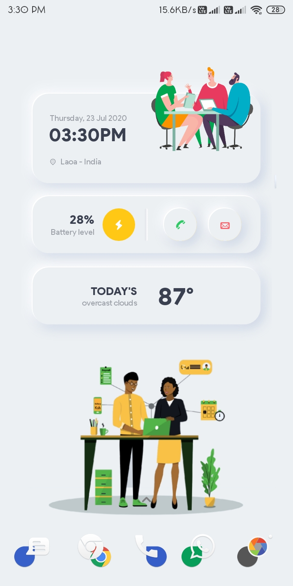
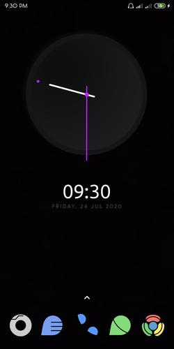

<h2 align=center>Awesome-Homescreens</h2>

 

A list of community-shared beautiful android homescreen setups 

<b>Share your screenshots now!</b>

<b>Read contributing.md file for more details</b>

# Categories
  * [3D](#3d)
  * [Abstract](#abstract)
  * [B&W](#bnw)
  * [Funny](#funny)
  * [Girly](#girly)
  * [Minimal](#minimal)
  * [Modern](#modern-UI)
  * [Patriotic](#patriotic)
  * [Sci-Fi](#sci-fi)
  * [Sketch](#sketch)
  * [Other](#other)

## 3D

## Abstract

## BnW

## Funny

## Girly

## Minimal

  

    
deep5050

    

    

    

    

  

## Modern UI

  

    
deep5050

    

  

  
## Patriotic

  

    
deep5050

    

  

## Sci-Fi

## Sketch

## Other

